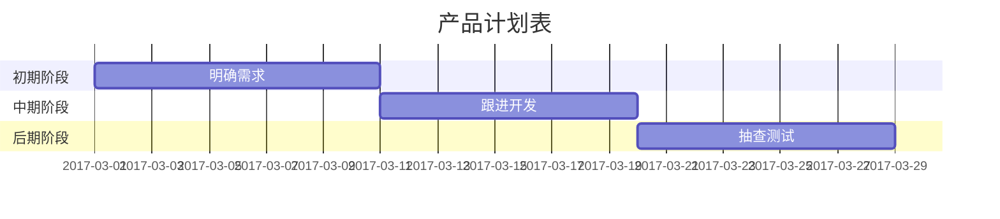

---
layout:     post
title:      ReactiveCocoa 进阶
subtitle:   函数式编程框架 ReactiveCocoa 进阶
date:       2017-01-06
author:     BY
header-img: img/post-bg-ios9-web.jpg
catalog: true
tags:
    - iOS
    - ReactiveCocoa
    - 函数式编程
    - 开源框架

---
# 目录
## 斜体和粗体
```javascript?linenums
*斜体*或_斜体_
**粗体**
***加粗斜体***
~~删除线~~
```
**显示效果**

*斜体*或_斜体_
**粗体**
***加粗斜体***
~~删除线~~

 ## 分级标题

第一种写法：
```javascript?linenums
这是一个一级标题
============================

这是一个二级标题
--------------------------------------------------
```
第二种写法：

```javascript?linenums
# 一级标题
## 二级标题
### 三级标题
#### 四级标题
##### 五级标题
###### 六级标题
```
## 超链接
Markdown 支持两种形式的链接语法： 行内式和参考式两种形式，行内式一般使用较多。

### 行内式

**语法说明：**
>[]里写链接文字，()里写链接地址, ()中的""中可以为链接指定title属性，title属性可加可不加。title属性的效果是鼠标悬停在链接上会出现指定的 title文字。[链接文字](链接地址 "链接标题")这样的形式。**链接地址与链接标题前有一个空格。**

```javascript?linenums
欢迎来到[迟道的主页](http://www.jianshu.com/u/de4923b06bfc)

欢迎来到[迟道的主页](http://www.jianshu.com/u/de4923b06bfc "迟道的主页")
```
**显示效果**
欢迎来到[迟道的主页](http://www.jianshu.com/u/de4923b06bfc)
欢迎来到[迟道的主页](http://www.jianshu.com/u/de4923b06bfc "迟道的主页")
### 参考式
参考式超链接一般用在学术论文上面，或者另一种情况，如果某一个链接在文章中多处使用，那么使用引用 的方式创建链接将非常好，它可以让你对链接进行统一的管理。

**语法说明：**
参考式链接分为两部分，文中的写法 [链接文字][链接标记]，在文本的任意位置添加[链接标记]:链接地址 "链接标题"，**链接地址与链接标题前有一个空格。**

如果链接文字本身可以做为链接标记，你也可以写成[链接文字][]
[链接文字]：链接地址的形式，见代码的最后一行。

**代码：**
```javascript?linenums
我经常去的几个网站[GitHub][1]、[知乎][2]以及[简书][3]
[简书][3]是一个不错的[写作社区][]。

[1]:https://github.com "GitHub"
[2]:https://www.zhihu.com "知乎"
[3]:http://www.jianshu.com "简书"
[写作社区]:http://www.jianshu.com
```

**显示效果：**
我经常去的几个网站[GitHub][1]、[知乎][2]以及[简书][3]
[简书][3]是一个不错的[写作社区][]。

[1]:https://github.com "GitHub"
[2]:https://www.zhihu.com "知乎"
[3]:http://www.jianshu.com "简书"
[写作社区]:http://www.jianshu.com

### 自动链接

**语法说明：**
Markdown 支持以比较简短的自动链接形式来处理网址和电子邮件信箱，只要是用<>;包起来， Markdown 就会自动把它转成链接。一般网址的链接文字就和链接地址一样，例如：

**代码：**
```javascript?linenums
<http://example.com/>
<address@example.com>
```

**显示效果：**

<http://example.com/>
<address@example.com>

## 锚点

网页中，锚点其实就是页内超链接，也就是链接本文档内部的某些元素，实现当前页面中的跳转。比如我这里写下一个锚点，点击回到目录，就能跳转到目录。 在目录中点击这一节，就能跳过来。还有下一节的注脚。这些根本上都是用锚点来实现的。

**注意：** Markdown Extra 只支持在标题后插入锚点，其它地方无效。

**语法描述：**
在你准备跳转到的指定标题后插入锚点{#标记}，然后在文档的其它地方写上连接到锚点的链接。

**代码：**
```javascript?linenums
## 0. 目录{#index}
跳转到[目录](#index)
```

**显示效果**

## 0. 目录{#index}
跳转到[目录](#index)

## 列表

### 无序列表

使用 *，+，- 表示无序列表。

**代码：**

```javascript?linenums
- 无序列表项 一
- 无序列表项 二
- 无序列表项 三
 ```

**显示效果：**

- 无序列表项 一
- 无序列表项 二
- 无序列表项 三

### 有序列表

有序列表则使用数字接着一个英文句点。
**代码：**
```javascript?linenums
1. 有序列表项 一
2. 有序列表项 二
3. 有序列表项 三
```

**显示效果：**
1. 有序列表项 一
2. 有序列表项 二
3. 有序列表项 三

### 定义型列表

**语法说明：**

定义型列表由名词和解释组成。一行写上定义，紧跟一行写上解释。解释的写法:紧跟一个缩进(Tab)

**代码：**

```javascript?linenums
Markdown
:    轻量级文本标记语言，可以转换成html，pdf等格式（左侧有一个可见的冒号和四个不可见的空格）

代码块 2
:   这是代码块的定义（左侧有一个可见的冒号和四个不可见的空格）

        代码块（左侧有八个不可见的空格）
```

**显示效果：**

Markdown
:    轻量级文本标记语言，可以转换成html，pdf等格式（左侧有一个可见的冒号和四个不可见的空格）

代码块 2
:   这是代码块的定义（左侧有一个可见的冒号和四个不可见的空格）

        代码块（左侧有八个不可见的空格）

### 列表缩进

**语法说明：**

列表项目标记通常是放在最左边，但是其实也可以缩进，最多 3 个空格，项目标记后面则一定要接着至少一个空格或制表符。

要让列表看起来更漂亮，你可以把内容用固定的缩进整理好（显示效果与代码一致）：

*   轻轻的我走了， 正如我轻轻的来； 我轻轻的招手， 作别西天的云彩。
那河畔的金柳， 是夕阳中的新娘； 波光里的艳影， 在我的心头荡漾。 
软泥上的青荇， 油油的在水底招摇； 在康河的柔波里， 我甘心做一条水草！ 
*   那榆荫下的一潭， 不是清泉， 是天上虹； 揉碎在浮藻间， 沉淀着彩虹似的梦。 
寻梦？撑一支长篙， 向青草更青处漫溯； 满载一船星辉， 在星辉斑斓里放歌。 
但我不能放歌， 悄悄是别离的笙箫； 夏虫也为我沉默， 沉默是今晚的康桥！ 
悄悄的我走了， 正如我悄悄的来； 我挥一挥衣袖， 不带走一片云彩。

但是如果你懒，那也行：
**代码：**

```javascript?linenums
*   轻轻的我走了， 正如我轻轻的来； 我轻轻的招手， 作别西天的云彩。
那河畔的金柳， 是夕阳中的新娘； 波光里的艳影， 在我的心头荡漾。 
软泥上的青荇， 油油的在水底招摇； 在康河的柔波里， 我甘心做一条水草！ 
*   那榆荫下的一潭， 不是清泉， 是天上虹； 揉碎在浮藻间， 沉淀着彩虹似的梦。 
寻梦？撑一支长篙， 向青草更青处漫溯； 满载一船星辉， 在星辉斑斓里放歌。 
但我不能放歌， 悄悄是别离的笙箫； 夏虫也为我沉默， 沉默是今晚的康桥！ 
悄悄的我走了， 正如我悄悄的来； 我挥一挥衣袖， 不带走一片云彩。
```
**显示效果：**
*   轻轻的我走了， 正如我轻轻的来； 我轻轻的招手， 作别西天的云彩。
那河畔的金柳， 是夕阳中的新娘； 波光里的艳影， 在我的心头荡漾。 
软泥上的青荇， 油油的在水底招摇； 在康河的柔波里， 我甘心做一条水草！ 
*   那榆荫下的一潭， 不是清泉， 是天上虹； 揉碎在浮藻间， 沉淀着彩虹似的梦。 
寻梦？撑一支长篙， 向青草更青处漫溯； 满载一船星辉， 在星辉斑斓里放歌。 
但我不能放歌， 悄悄是别离的笙箫； 夏虫也为我沉默， 沉默是今晚的康桥！ 
悄悄的我走了， 正如我悄悄的来； 我挥一挥衣袖， 不带走一片云彩。

### 包含段落的列表

**语法说明：**
列表项目可以包含多个段落，每个项目下的段落都必须缩进 4 个空格或是 1 个制表符（显示效果与代码一致）：

*   轻轻的我走了， 正如我轻轻的来； 我轻轻的招手， 作别西天的云彩。
那河畔的金柳， 是夕阳中的新娘； 波光里的艳影， 在我的心头荡漾。 
软泥上的青荇， 油油的在水底招摇； 在康河的柔波里， 我甘心做一条水草！

     那榆荫下的一潭， 不是清泉， 是天上虹； 揉碎在浮藻间， 沉淀着彩虹似的梦。 
寻梦？撑一支长篙， 向青草更青处漫溯； 满载一船星辉， 在星辉斑斓里放歌。 
但我不能放歌， 悄悄是别离的笙箫； 夏虫也为我沉默， 沉默是今晚的康桥！ 

*    悄悄的我走了， 正如我悄悄的来； 我挥一挥衣袖， 不带走一片云彩。
 
 如果你每行都有缩进，看起来会看好很多，当然，再次地，如果你很懒惰，Markdown 也允许：
 
 **代码：**
 ```javascript?linenums
 *   轻轻的我走了， 正如我轻轻的来； 我轻轻的招手， 作别西天的云彩。
那河畔的金柳， 是夕阳中的新娘； 波光里的艳影， 在我的心头荡漾。 
软泥上的青荇， 油油的在水底招摇； 在康河的柔波里， 我甘心做一条水草！

     那榆荫下的一潭， 不是清泉， 是天上虹； 揉碎在浮藻间， 沉淀着彩虹似的梦。 
寻梦？撑一支长篙， 向青草更青处漫溯； 满载一船星辉， 在星辉斑斓里放歌。 
但我不能放歌， 悄悄是别离的笙箫； 夏虫也为我沉默， 沉默是今晚的康桥！ 

*    悄悄的我走了， 正如我悄悄的来； 我挥一挥衣袖， 不带走一片云彩。
```

**显示效果：**

*   轻轻的我走了， 正如我轻轻的来； 我轻轻的招手， 作别西天的云彩。
那河畔的金柳， 是夕阳中的新娘； 波光里的艳影， 在我的心头荡漾。 
软泥上的青荇， 油油的在水底招摇； 在康河的柔波里， 我甘心做一条水草！

     那榆荫下的一潭， 不是清泉， 是天上虹； 揉碎在浮藻间， 沉淀着彩虹似的梦。 
寻梦？撑一支长篙， 向青草更青处漫溯； 满载一船星辉， 在星辉斑斓里放歌。 
但我不能放歌， 悄悄是别离的笙箫； 夏虫也为我沉默， 沉默是今晚的康桥！ 

*    悄悄的我走了， 正如我悄悄的来； 我挥一挥衣袖， 不带走一片云彩。

### 包含引用的列表

**语法说明：**
如果要在列表项目内放进引用，那 > 就需要缩进：

**代码：**

```javascript?linenums
*   阅读的方法:

    > 打开书本。
    > 打开电灯。
```

**显示效果：**

*   阅读的方法:

    > 打开书本。
    > 打开电灯。
### 包含代码区块的引用

**语法说明：**
如果要放代码区块的话，该区块就需要缩进两次，也就是 8 个空格或是 2 个制表符：
*	一列表项包含一个列表区块：
```
<代码写在这>
```

### 一个特殊情况

在特殊情况下，项目列表很可能会不小心产生，像是下面这样的写法：

```
1986. What a great season.
```
会显示成：

1986\. What a great season.

## 引用

**语法说明：**
引用需要在被引用的文本前加上>符号。

**代码：**

```javascript?linenums
> 这是一个有两段文字的引用,
>无意义的占行文字1.
>无意义的占行文字2.
>
>无意义的占行文字3.
>无意义的占行文字4.
```

**显示效果：**

> 这是一个有两段文字的引用,
>无意义的占行文字1.
>无意义的占行文字2.
>
>无意义的占行文字3.
>无意义的占行文字4.

Markdown 也允许你偷懒只在整个段落的第一行最前面加上 >：

**代码：**
```javascript?linenums
> 这是一个有两段文字的引用,
无意义的占行文字1.
无意义的占行文字2.

>无意义的占行文字3.
无意义的占行文字4.
```

**显示效果：**

> 这是一个有两段文字的引用,
无意义的占行文字1.
无意义的占行文字2.

>无意义的占行文字3.
无意义的占行文字4.

### 引用的多层嵌套

区块引用可以嵌套（例如：引用内的引用），只要根据层次加上不同数量的 >：

**代码：**

```javascript?linenums
>>> 请问 Markdwon 怎么用？ - 小白

>>自己看教程！ - 愤青

>教程在哪？ - 小白
```

**显示效果：**

>>> 请问 Markdwon 怎么用？ - 小白

>>自己看教程！ - 愤青

>教程在哪？ - 小白

### 引用其它要素

引用的区块内也可以使用其他的 Markdown 语法，包括标题、列表、代码区块等：
**代码：**

```javascript?linenums
> 1.   这是第一行列表项。
> 2.   这是第二行列表项。
>
> 给出一些例子代码：
> 
>     return shell_exec("echo $input | $markdown_script");
```

**显示效果：**

> 1.   这是第一行列表项。
> 2.   这是第二行列表项。
>
> 给出一些例子代码：
> 
>     return shell_exec("echo $input | $markdown_script");

## 插入图像

图片的创建方式与超链接相似，而且和超链接一样也有两种写法，行内式和参考式写法。

语法中图片Alt的意思是如果图片因为某些原因不能显示，就用定义的图片Alt文字来代替图片。 图片Title则和链接中的Title一样，表示鼠标悬停与图片上时出现的文字。 Alt 和 Title 都不是必须的，可以省略，但建议写上。

### 行内式

**语法说明：** 

**代码：**

```javascript?linenums
快乐学习： 

```

**显示效果：**

快乐学习： 


### 参考式

**语法说明：**
在文档要插入图片的地方写![图片Alt][标记]

在文档的最后写上[标记]:图片地址 "Title"

**代码：**
```javascript?linenums
快乐学习：
![快乐学习][study]

[study]:http://upload-images.jianshu.io/upload_images/1001659-7535c9e3fe16240d?imageMogr2/auto-orient/strip%7CimageView2/2/w/1240 "快乐学习"
```

**显示效果：**

快乐学习：
![快乐学习][study]

[study]:http://upload-images.jianshu.io/upload_images/1001659-7535c9e3fe16240d?imageMogr2/auto-orient/strip%7CimageView2/2/w/1240 "快乐学习"

## 内容目录 （注：简书Markdown不支持目录功能）

在段落中填写 [TOC] 以显示全文内容的目录结构。

效果参见最上方的目录

## 注脚

**语法说明：**

在需要添加注脚的文字后加上脚注[^注脚名字],称为加注。 然后在文本的任意位置(一般在最后)添加脚注，脚注前必须有对应的脚注名字。

注意：经测试注脚与注脚之间必须空一行，不然会失效。成功后会发现，即使你没有把注脚写在文末，经Markdown转换后，也会自动归类到文章的最后。

**代码：**

```javascript?linenums
使用 Markdown[^1]可以效率的书写文档, 直接转换成 HTML[^2], 你可以使用简书或者支持Markdown的编辑器进行书写。

[^1]:Markdown是一种纯文本标记语言

[~2]:HyperText Markup Language 超文本标记语言
```

**显示效果：**

使用 Markdown[^1]可以效率的书写文档, 直接转换成 HTML[^2], 你可以使用简书或者支持Markdown的编辑器进行书写。

[^1]:Markdown是一种纯文本标记语言

[^2]:HyperText Markup Language 超文本标记语言

**注：脚注自动被搬运到最后面，请到文章末尾查看，并且脚注后方的链接可以直接跳转回到加注的地方。**

## 数学公式

### $ 表示行内公式： （注：简书Markdown不支持此公式写法）

**代码：**

```javascript?linenums
质能守恒方程可以用一个很简洁的方程式 $E=mc^2$ 来表达。
```

**显示效果：**

质能守恒方程可以用一个很简洁的方程式 $E=mc^2$ 来表达。

### $$ 表示整行公式：（注：简书Markdown不支持此公式写法）

**代码：**

```javascript?linenums
$$\sum_{i=1}^n a_i=0$$

$$f(x_1,x_x,\ldots,x_n) = x_1^2 + x_2^2 + \cdots + x_n^2 $$

$$\sum^{j-1}_{k=0}{\widehat{\gamma}_{kj} z_k}$$
```

**显示效果：**

$$\sum_{i=1}^n a_i=0$$

$$f(x_1,x_x,\ldots,x_n) = x_1^2 + x_2^2 + \cdots + x_n^2 $$

$$\sum^{j-1}_{k=0}{\widehat{\gamma}_{kj} z_k}$$


访问(MathJax[https://math.meta.stackexchange.com/questions/5020/mathjax-basic-tutorial-and-quick-reference]) MathJax 参考更多使用方法。
### 简书公式写法

使用forkosh服务器，forkosh上提供了关于Latex公式的一份简短而很有用的帮助，参考[4]和[5].
[4]:http://www.forkosh.com/mathtextutorial.html
[5]:http://www.forkosh.com/mathtex.html
使用forkosh插入公式的方法是：

```javascript?linenums

```
示例1：

```javascript?linenums

```

效果：


示例2：

```javascript?linenums

```

效果：


示例3：

```javascript?linenums
 = x_1^2 + x_2^2 + \cdots + x_n^2)
```

效果：

 = x_1^2 + x_2^2 + \cdots + x_n^2)

示例4：

```javascript?linenums

```

效果：


## 表格

**语法说明：**

1.不管是哪种方式，第一行为表头，第二行分隔表头和主体部分，第三行开始每一行为一个表格行。
2.列于列之间用管道符|隔开。原生方式的表格每一行的两边也要有管道符。
3.第二行还可以为不同的列指定对齐方向。默认为左对齐，在-右边加上:就右对齐。

**代码：**

简单方式写表格：

```javascript?linenums
学号|姓名|分数
-|-|-
小明|男|75
小红|女|79
小陆|男|92
```

原生方式写表格：

```javascript?linenums
|学号|姓名|分数|
|-|-|-|
|小明|男|75|
|小红|女|79|
|小陆|男|92|
```

为表格第二列指定方向：

```javascript?linenums
产品|价格
-|-:
Leanote 高级账号|60元/年
Leanote 超级账号|120元/年
```

**显示效果：**

简单方式写表格：

学号|姓名|分数
-|-|-
小明|男|75
小红|女|79
小陆|男|92

原生方式写表格：

|学号|姓名|分数|
|-|-|-|
|小明|男|75|
|小红|女|79|
|小陆|男|92|

为表格第二列指定方向：

产品|价格
-|-:
Leanote 高级账号|60元/年
Leanote 超级账号|120元/年

## 分割线

你可以在一行中用三个以上的星号、减号、底线来建立一个分隔线，行内不能有其他东西。你也可以在星号或是减号中间插入空格。下面每种写法都可以建立分隔线：

**代码：**

```javascript?linenums
* * *

***

*****

- - -

---------------------------------------
```

**显示效果：**

* * *

***

*****

- - -

---------------------------------------

## 代码
```javascript?linenums
对于程序员来说这个功能是必不可少的，插入程序代码的方式有两种，一种是利用缩进(Tab), 另一种是利用“`"符号（一般在ESC键下方）包裹代码。
```

**语法说明：**

1.插入行内代码，即插入一个单词或者一句代码的情况，使用`code`这样的形式插入。
2.插入多行代码，可以使用缩进或者``` code ```,具体看示例。

**注意： 缩进式插入前方必须有空行**

### 行内式

**代码：**

```javascript?linenums
C语言里的函数 `scanf()` 怎么使用？
```

**显示效果：**

C语言里的函数 `scanf()` 怎么使用？

### 缩进式多行代码

缩进 4 个空格或是 1 个制表符

一个代码区块会一直持续到没有缩进的那一行（或是文件结尾）。

**代码：**

```javascript?linenums
#include <stdio.h>
    int main(void)
    {
        printf("Hello world\n");
    }
```

**显示效果：**

#include <stdio.h>
    int main(void)
    {
        printf("Hello world\n");
    }

### 用用六个`包裹多行代码`

**代码：**

```javascript?linenums
#include <stdio.h>
int main(void)
{
printf("Hello world\n");
}
```
**显示效果：**

```javascript?linenums
#include <stdio.h>
int main(void)
{
printf("Hello world\n");
}
```

### 代码高亮

代码高亮示例:

```javascript?linenums
/**
* nth element in the fibonacci series.
* @param n >= 0
* @return the nth element, >= 0.
*/
function fib(n) {
  var a = 1, b = 1;
  var tmp;
  while (--n >= 0) {
    tmp = a;
    a += b;
    b = tmp;
  }
  return a;
}
 
document.write(fib(10));
```

```javascript?linenums
class Employee:
   empCount = 0
 
   def __init__(self, name, salary):
        self.name = name
        self.salary = salary
        Employee.empCount += 1
```
### HTML 原始码 （注：简书Markdown不支持HTML原始码）

在代码区块里面， & 、 < 和 > 会自动转成 HTML 实体，这样的方式让你非常容易使用 Markdown 插入范例用的 HTML 原始码，只需要复制贴上，剩下的 Markdown 都会帮你处理，例如：

**代码：**

第一个例子：

```javascript?linenums
<div class="footer">
   © 2004 Foo Corporation
</div>
```

第二个例子：

```javascript?linenums
<table>
    <tr>
        <th rowspan="2">值班人员</th>
        <th>星期一</th>
        <th>星期二</th>
        <th>星期三</th>
    </tr>
    <tr>
        <td>李强</td>
        <td>张明</td>
        <td>王平</td>
    </tr>
</table>
```

**显示效果：**

第一个例子：

<div class="footer">
   © 2004 Foo Corporation
</div>

第二个例子：

<table>
    <tr>
        <th rowspan="2">值班人员</th>
        <th>星期一</th>
        <th>星期二</th>
        <th>星期三</th>
    </tr>
    <tr>
        <td>李强</td>
        <td>张明</td>
        <td>王平</td>
    </tr>
</table>

## todo list （注：简书Markdown不支持todo list）

代码：

```javascript?linenums
近期任务安排:
- [ ] 整理Markdown手册
- [ ] 改善项目
   - [x] 优化首页显示方式
   - [x] 修复闪退问题
   - [ ] 修复视频卡顿
- [ ] A3项目修复
   - [x] 修复数值错误

```

效果;

近期任务安排:
  - [ ] 整理Markdown手册
- [x] 改善项目
- [ ] 
   - [x] 优化首页显示方式
   - [x] 修复闪退问题
   - [ ] 修复视频卡顿
- [ ] A3项目修复
   - [x] 修复数值错误

### 统计图

```plot!
{
"data": [ [[0, 0], [1, 1]] ],
"options": { "yaxis": { "max": 1 } }
}
```

## 时序图 （注：简书Markdown不支持时序图）

  >* 时序图语法
  
  代码：
  
  <code>```</code>sequence!
 participant 客户端 as A
participant 服务端 as B
participant 通行证中心 as C
Note over A:用户输入通行证账号、密码
A->C: 发送账号、密码
Note over C:验证账号、密码
C-->>A:返回token
A->B:发送token
B->C:验证token
C-->>B:验证成功
B-->>A:登陆成功
Note left of A:左边注释
B->B:自交互
Note right of C:右边注释
 
 <code>```</code>
**显示效果：**


```sequence!
participant 客户端 as A
participant 服务端 as B
participant 通行证中心 as C
Note over A:用户输入通行证账号、密码
A->C: 发送账号、密码
Note over C:验证账号、密码
C-->>A:返回token
A->B:发送token
B->C:验证token
C-->>B:验证成功
B-->>A:登陆成功
Note left of A:左边注释
B->B:自交互
Note right of C:右边注释
```
## 流程图 （注：简书Markdown不支持流程图）

> *  流程图语法

<code>```</code>flow! 
st=>start: 开始
io=>inputoutput: 验证
op=>operation: 选项
cond=>condition: 是 或 否？
sub=>subroutine: 子程序
e=>end: 结束
st->io->op->cond
cond(yes)->e
cond(no)->sub->io

 <code>```</code>
效果：

```flow!
st=>start: 开始
io=>inputoutput: 验证
op=>operation: 选项
cond=>condition: 是 或 否？
sub=>subroutine: 子程序
e=>end: 结束

st->io->op->cond
cond(yes)->e
cond(no)->sub->io
```

## 甘特图 （注：简书Markdown不支持甘特图）

> * 甘特图语法
>* 附甘特图实例（需在第一行添加mermaid并以开头，在最后一行添加结尾）。简书的Markdown编辑器会自动将代码第一行及最后一行过滤。


 <code>```</code>mermaid!
gantt
dateFormat YYYY-MM-DD
title 产品计划表
section 初期阶段
明确需求: 2017-03-01, 10d
section 中期阶段
跟进开发: 2017-03-11, 9d
section 后期阶段
抽查测试: 2017-03-20, 9d

 <code>```</code>
 
#### 效果：




